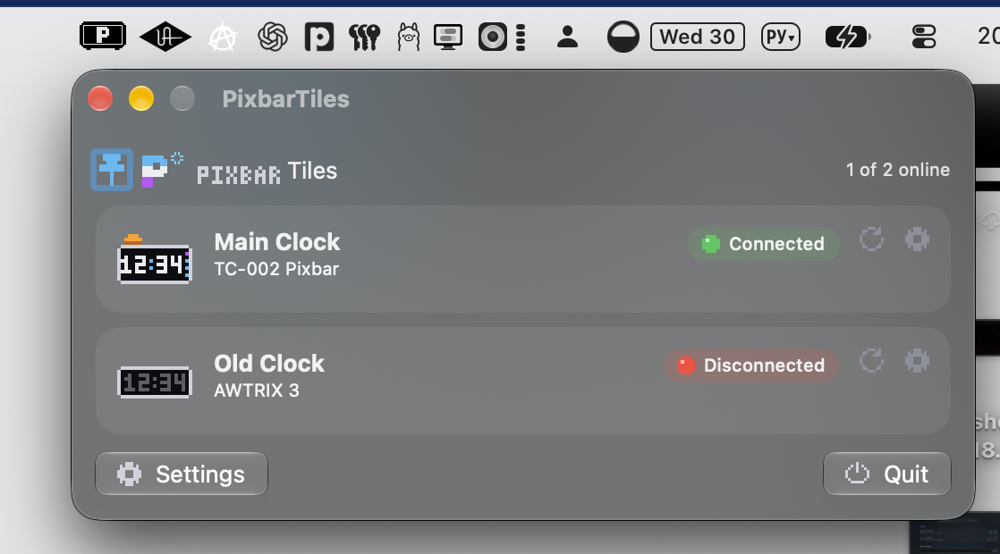
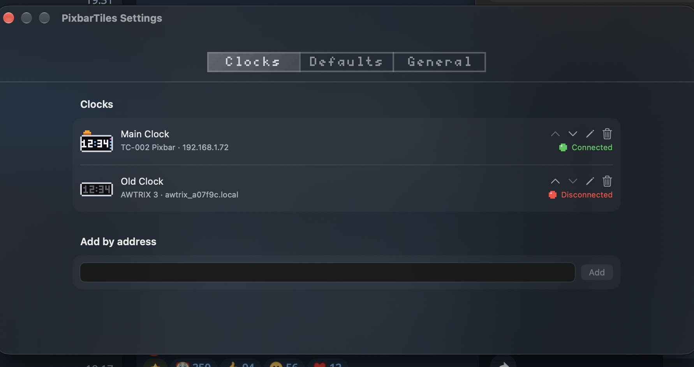
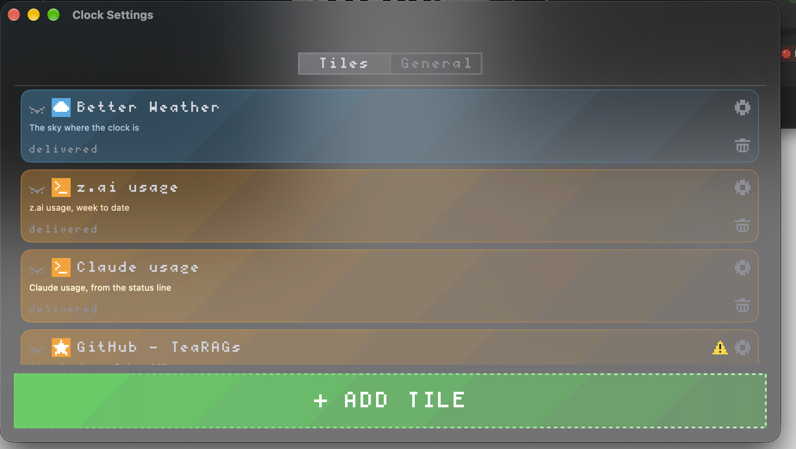
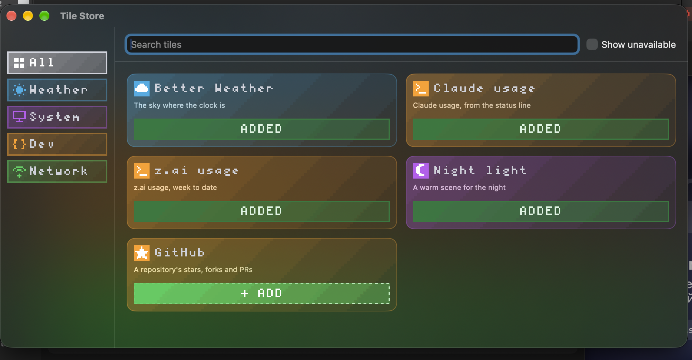
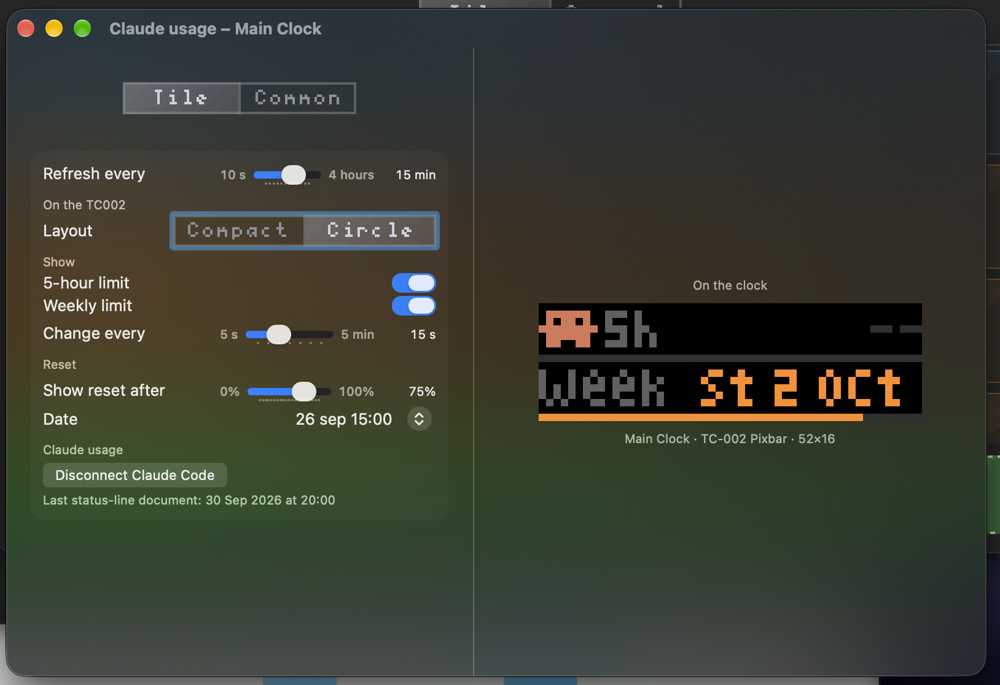
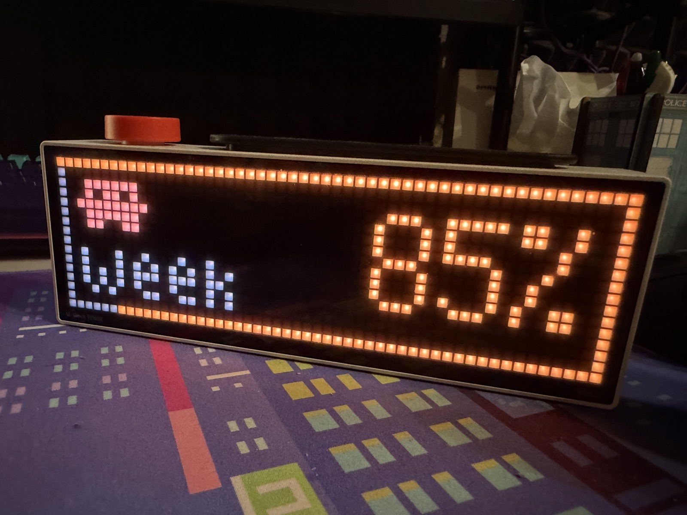
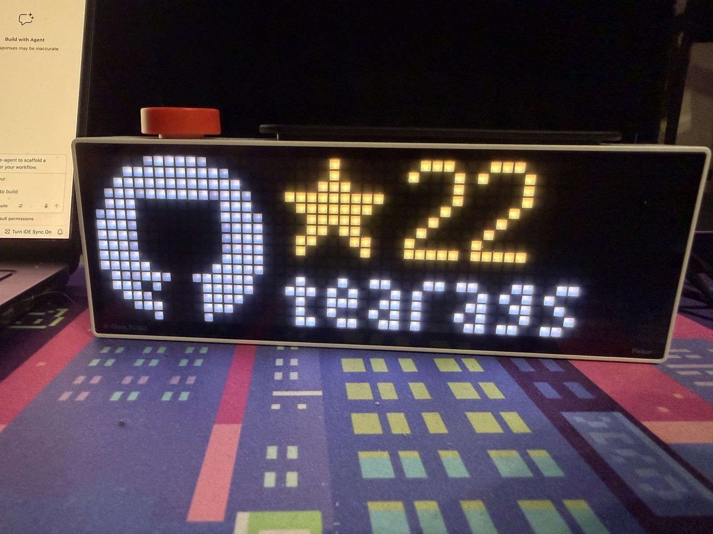
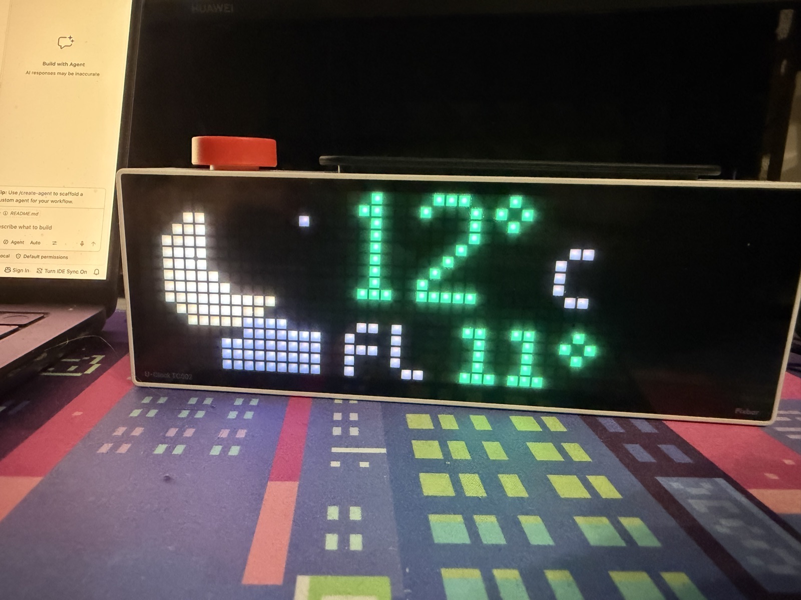
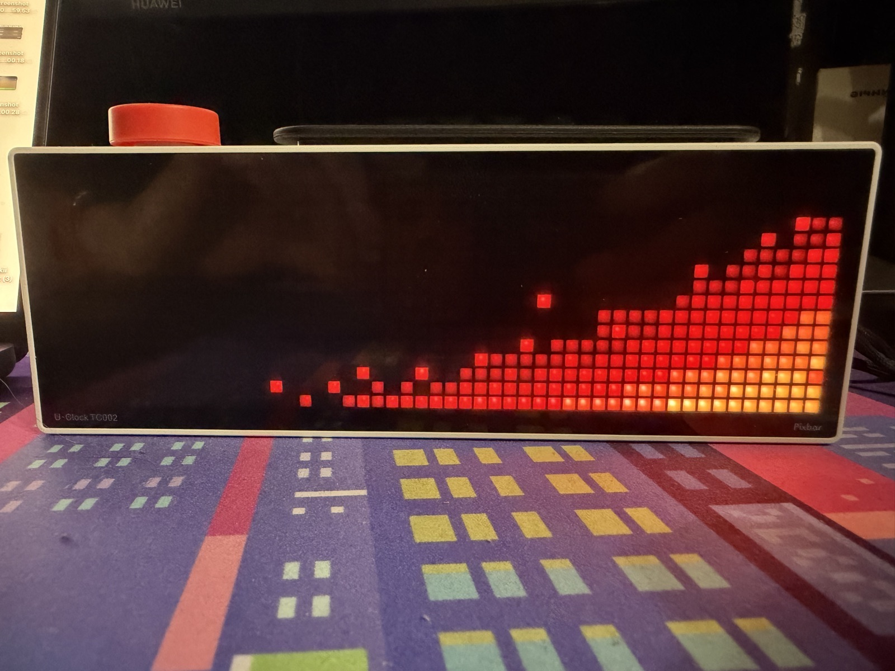

<p align="center">
  
</p>

<h1 align="center">PixbarTiles</h1>

<p align="center">A macOS menu bar app that turns Ulanzi pixel clocks into a row of live tiles.</p>

---

PixbarTiles drives one or more Ulanzi pixel clocks from your Mac. Each
connector is a small app you place on a clock as a **tile**; it draws every
clock model through a face of its own, so the same tile looks right on a 32×8
TC001 and on a 52×16 TC002.

## Screenshots

| | |
|---|---|
|  |  |
| The menu bar panel: every clock, its status and a recheck | Settings: the clocks the app drives |
|  |  |
| One clock's tiles, in the order it shows them | The Tile Store, where a tile is added to a clock |
|  | |
| A tile's settings, with a live preview of the clock | |

## Clock Photos

| | |
|---|---|
|  |  |
| Claude usage: the weekly limit | GitHub: a repository's stars |
|  |  |
| Weather: temperature and feels-like at night | Night light: a warm scene for the dark |

## Clocks

| Clock | Firmware | Panel | How the app talks to it |
|---|---|---|---|
| Ulanzi TC001 | AWTRIX 3 | 32 × 8 | AWTRIX HTTP API: custom apps, notifications, indicators, RTTTL sound |
| Ulanzi TC002 | stock | 52 × 16 | Custom apps (`/api/custom`), one full-frame GIF per page |

> **AWTRIX 3 is on its way out.** Its support will be dropped and replaced
> with AWTRIX NG, since AWTRIX 3 is discontinued upstream.

Several clocks of both models can be driven at once. They are listed in
Settings and found on the network by Bonjour (TC001) or the TC002's UDP
announcement.

## Tiles

| Tile | What it shows |
|---|---|
| Weather | Current conditions with animated icons, feels-like colour, rotating detail lines, optional moon phase |
| Claude usage | Claude Code's session and weekly limits, read from Claude Code's status line |
| z.ai usage | The z.ai coding-plan limits |
| VPN | A lamp per VPN connection, scheduled by time or Focus |
| GitHub | Repository activity and events, with an interruption when something happens |
| Night light | A warm full-screen scene for the night, TC002 only |

A clock's battery is part of its status rather than a tile: the app warns on
thresholds with a discharge estimate.

The app pauses what it sends while the clock is unreachable, while macOS
reports a Focus, and while a watched microphone is capturing.

## Requirements

- macOS 26
- Swift 6.2 (Xcode 26 toolchain)

## Build and run

```bash
./Scripts/bundle.sh debug     # builds build/PixbarTiles.app
open build/PixbarTiles.app
```

The first launch after an upgrade from PixelClockTiles moves its settings,
Application Support folder, secrets and TC002 pages to the new name.

## Tests

```bash
swift test --no-parallel
```

The TC002 faces are tested pixel for pixel against the frames of their
approved mockups: the generators live in `.claude/skills/tc002-face-mockup/`,
and `Scripts/make_*_face_oracle.py` records them as fixtures under
`Tests/PixbarKitTests/Fixtures/`. Never edit an oracle fixture by hand.

## Layout

| Path | What lives there |
|---|---|
| `Sources/PixbarKit` | Connectors, faces, clock sessions (`Awtrix/`, `Ulanzi/`), persistence, secrets |
| `Sources/PixbarTilesApp` | The menu bar app: composition root, panel, settings, menu bar glyph |
| `Scripts/` | Bundling, icon rendering, oracle recorders |
| `docs/HANDOFF.md` | Measured hardware facts and the state of the work — read it first |
| `docs/superpowers/specs`, `docs/superpowers/plans` | Designs and implementation plans |
| `docs/brand/` | The app icon |

## Status

Personal project, free software.

AWTRIX 3 support will be dropped: the firmware is discontinued upstream, and
the TC001 will be driven through AWTRIX NG instead.
